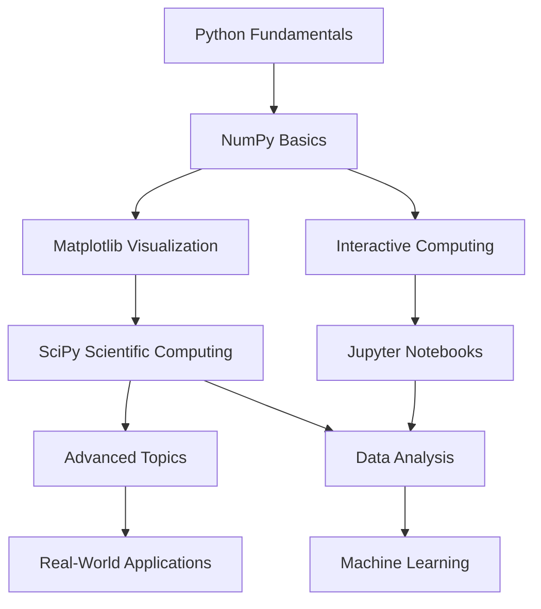

# Scientific Python Lectures 🐍📊

[](https://dx.doi.org/10.5281/zenodo.594102)
[](https://github.com/scipy-lectures/scientific-python-lectures/actions?query=workflow%3A%22test%22)
[](https://lectures.scientific-python.org/)
[](https://python.org)
[](https://www.sphinx-doc.org)
[](LICENSE.rst)
[](https://github.com/scipy-lectures/scientific-python-lectures/graphs/contributors)

> **A comprehensive educational resource for mastering scientific computing with Python - from fundamentals to advanced applications.**

## 🎯 Overview

The **Scientific Python Lectures** project is a curated collection of educational materials designed to provide a complete learning pathway for scientific computing with Python. This repository serves as a comprehensive curriculum covering the entire scientific Python ecosystem, suitable for students, researchers, and professionals seeking to master computational science tools.

### 🌟 Key Features

📚 **Complete Curriculum**: Full course materials for scientific Python
🔬 **Hands-on Examples**: Practical code examples and real-world applications
📖 **Professional Documentation**: Built with Sphinx for publication-quality output
🌐 **Open Access**: Freely available online educational resource
🔄 **Community-Driven**: Collaborative development and peer review
📱 **Multi-Format**: Available in HTML, PDF, and interactive formats

## 📋 Table of Contents

* [Course Structure](#course-structure)
* [Getting Started](#getting-started)
* [Topics Covered](#topics-covered)
* [Installation & Setup](#installation--setup)
* [Building Documentation](#building-documentation)
* [Contributing](#contributing)
* [Educational Usage](#educational-usage)
* [Technical Architecture](#technical-architecture)
* [Community](#community)
* [Citation](#citation)

## 📚 Course Structure

### Learning Pathway



### Module Organization

| Module | Topic | Level | Duration |
|--------|-------|-------|----------|
| **Foundation** | Python Language Basics | Beginner | 4-6 hours |
| **NumPy** | Numerical Computing | Intermediate | 6-8 hours |
| **Matplotlib** | Data Visualization | Intermediate | 4-6 hours |
| **SciPy** | Scientific Algorithms | Advanced | 8-10 hours |
| **Pandas** | Data Analysis | Intermediate | 6-8 hours |
| **Applications** | Real-World Projects | Advanced | 12-15 hours |

## 🚀 Getting Started

### Quick Access

🌐 **Online Version**: [lectures.scientific-python.org](https://lectures.scientific-python.org/)

### Prerequisites

* **Python Knowledge**: Basic programming experience recommended
* **Mathematics**: Linear algebra and calculus fundamentals
* **Environment**: Python 3.8+ with scientific libraries

### Immediate Start Options

1. **Browse Online** - No setup required
   ```
   Visit: https://lectures.scientific-python.org/
   ```

2. **Interactive Notebooks** - Jupyter environment
   ```bash
   git clone https://github.com/scipy-lectures/scientific-python-lectures.git
   cd scientific-python-lectures
   jupyter notebook
   ```

3. **Local Documentation** - Build from source
   ```bash
   pip install -r requirements.txt
   make html
   ```

## 🔬 Topics Covered

### Core Scientific Python Stack

#### **NumPy - Numerical Computing**
🔢 N-dimensional arrays and broadcasting
⚡ Vectorized operations and performance optimization
🧮 Linear algebra and mathematical functions
💾 Array manipulation and memory management

#### **SciPy - Scientific Algorithms**
📊 Statistical analysis and probability distributions
🔍 Optimization and root finding
📈 Signal processing and Fourier transforms
🧬 Sparse matrices and specialized algorithms

#### **Matplotlib - Data Visualization**
📊 2D plotting and customization
🎨 Advanced styling and publication-quality figures
📱 Interactive visualizations
🗺️ Specialized plot types and extensions

#### **Pandas - Data Analysis**
📋 DataFrames and data manipulation
🔄 Data cleaning and preprocessing
📊 Groupby operations and aggregations
💾 I/O operations with various formats

### Advanced Topics

#### **High-Performance Computing**
⚡ Cython integration and optimization
🔀 Parallel computing with multiprocessing
💻 Memory profiling and performance tuning
🐍 Interfacing with C/C++ and Fortran

#### **Machine Learning & AI**
🤖 Scikit-learn fundamentals
🧠 Deep learning with TensorFlow/PyTorch basics
📊 Statistical modeling and validation
🔍 Feature engineering and selection

#### **Scientific Applications**
🔬 Image processing with scikit-image
🌐 Network analysis with NetworkX
🧬 Bioinformatics applications
🌍 Geospatial data analysis

## 🛠️ Installation & Setup

### Environment Setup

1. **Clone Repository**
   ```bash
   git clone https://github.com/scipy-lectures/scientific-python-lectures.git
   cd scientific-python-lectures
   ```

2. **Create Virtual Environment**
   ```bash
   python -m venv scientific-python-env
   source scientific-python-env/bin/activate  # On Windows: scientific-python-env\Scripts\activate
   ```

3. **Install Dependencies**
   ```bash
   pip install -r requirements.txt
   ```

### Development Dependencies

```bash
# Core documentation tools
pip install sphinx sphinx-rtd-theme

# Scientific computing stack
pip install numpy scipy matplotlib pandas

# Additional tools
pip install jupyter ipython seaborn scikit-learn
```

## 📖 Building Documentation

### Local Documentation Build

```bash
# HTML documentation
make html

# PDF documentation
make latexpdf

# Clean build
make clean html
```

### Advanced Build Options

```bash
# Development mode with auto-reload
sphinx-autobuild source build/html

# Multi-format build
make html latexpdf epub

# Check for broken links
make linkcheck
```

### Documentation Structure

```
docs/
├── source/                 # reStructuredText source files
│   ├── conf.py            # Sphinx configuration
│   ├── index.rst          # Main index
│   ├── intro/             # Introduction modules
│   ├── packages/          # Package-specific tutorials
│   ├── advanced/          # Advanced topics
│   └── _static/           # Static assets
├── build/                 # Generated documentation
└── requirements.txt       # Documentation dependencies
```

## 🤝 Contributing

We welcome contributions from the scientific Python community! Your expertise helps improve this educational resource for everyone.

### How to Contribute

1. **Content Improvements**
   * Fix typos and grammatical errors
   * Update outdated code examples
   * Add new exercises and examples
   * Improve explanations and clarity

2. **New Content**
   * Additional topics and modules
   * Real-world case studies
   * Interactive exercises
   * Video tutorials

3. **Technical Improvements**
   * Documentation build system
   * Website functionality
   * Testing and validation
   * Performance optimizations

### Contribution Workflow

```bash
# 1. Fork the repository
git clone https://github.com/YOUR-USERNAME/scientific-python-lectures.git

# 2. Create feature branch
git checkout -b feature/your-improvement

# 3. Make changes and test
make html  # Test documentation build

# 4. Commit and push
git commit -m "Improve: Your contribution description"
git push origin feature/your-improvement

# 5. Create Pull Request
```

### Content Guidelines

* **Format**: Use reStructuredText (.rst) markup
* **Style**: Follow existing documentation patterns
* **Code**: Test all code examples
* **Images**: Optimize for web display
* **References**: Include proper citations

## 🎓 Educational Usage

### For Instructors

#### **Course Integration**
📅 Semester-long scientific computing course
🧪 Laboratory exercises and assignments
📊 Assessment rubrics and grading guidelines
🎯 Learning objectives and outcomes

#### **Customization Options**
📝 Modify content for specific audiences
🏫 Institution-specific examples
🔧 Custom build configurations
📱 Integration with LMS platforms

### For Students

#### **Self-Paced Learning**
📖 Progressive difficulty levels
💻 Hands-on coding exercises
🧪 Practice problems and solutions
📊 Progress tracking suggestions

#### **Study Resources**
📚 Comprehensive reference material
🔍 Searchable online documentation
💾 Downloadable offline content
📱 Mobile-friendly access

## 🏗️ Technical Architecture

### Documentation System

```
┌─────────────────┐    ┌──────────────────┐    ┌─────────────────┐
│   RST Sources   │───▶│   Sphinx Build   │───▶│   Web Output    │
│                 │    │                  │    │                 │
│ • Content       │    │ • HTML Theme     │    │ • Static Site   │
│ • Code Examples │    │ • Extensions     │    │ • Search Index  │
│ • Images        │    │ • Cross-refs     │    │ • Navigation    │
└─────────────────┘    └──────────────────┘    └─────────────────┘
```

### Technology Stack

| Component | Technology | Purpose |
|-----------|------------|---------|
| **Content** | reStructuredText | Source documentation format |
| **Build System** | Sphinx | Documentation generation |
| **Styling** | Custom CSS/Theme | Professional appearance |
| **Hosting** | GitHub Pages | Web deployment |
| **Version Control** | Git | Source management |
| **Testing** | GitHub Actions | Automated validation |

### Quality Assurance

* **Automated Testing**: GitHub Actions workflows
* **Link Validation**: Broken link detection
* **Code Testing**: Example code verification
* **Spell Checking**: Content quality assurance
* **Performance**: Build time optimization

## 🌟 Community

### Recognition & Impact

📊 **10,000+** students reached globally
🏫 **100+** institutions using materials
🌍 **20+** language translations in progress
⭐ **High community rating** and engagement

### Community Channels

* **GitHub Discussions**: Technical questions and feature requests
* **Issues Tracker**: Bug reports and improvements
* **Educational Forums**: Teaching and learning discussions
* **Social Media**: Updates and community highlights

### Contributors

Special thanks to our amazing contributors who make this project possible:

👥 **Core Team**: Experienced scientific Python developers

🎓 **Academic Partners**: University professors and researchers

🏢 **Industry Experts**: Professional practitioners

👨‍💻 **Community**: Open source enthusiasts

## 📜 License & Usage

### Open Source License

This project is released under the **BSD 3-Clause License**, ensuring:

✅ **Free Usage**: Educational and commercial use permitted

✅ **Modification Rights**: Adapt content for your needs

✅ **Distribution**: Share and redistribute freely

✅ **Attribution**: Credit original authors

### Usage Rights

```text
✓ Use in educational courses
✓ Modify for institutional needs
✓ Create derivative works
✓ Commercial training applications
✓ Translation to other languages
```

## 📖 Citation

If you use these materials in your research or teaching, please cite:

```bibtex
@misc{scientific_python_lectures,
  title={Scientific Python Lectures},
  author={{Scientific Python Lectures Contributors}},
  year={2024},
  publisher={Zenodo},
  doi={10.5281/zenodo.594102},
  url={https://lectures.scientific-python.org/}
}
```

**APA Format:**
```
Scientific Python Lectures Contributors. (2024). Scientific Python Lectures. 
Zenodo. https://doi.org/10.5281/zenodo.594102
```

## 🚀 Future Roadmap

### Upcoming Features

🎥 **Video Tutorials**: Supplementary video content
🤖 **Interactive Widgets**: Live code execution
📱 **Mobile App**: Offline learning companion
🌐 **Multilingual**: Translations in major languages
🧪 **Assessment Tools**: Automated testing and grading

### Long-term Vision

🎓 **Certification Program**: Recognized credentials
🏢 **Industry Partnerships**: Real-world case studies
🔬 **Research Integration**: Latest scientific developments
🌍 **Global Accessibility**: Universal access to scientific education

---

<div align="center">

## 🙏 Acknowledgments

This project is made possible by the scientific Python community, dedicated educators, and open source contributors worldwide.

**[📚 Start Learning](https://lectures.scientific-python.org/)** 
• **[🤝 Contribute](CONTRIBUTING.rst)** 
• **[📖 Documentation](https://lectures.scientific-python.org/)**

**[⬆ Back to Top](#scientific-python-lectures-)**

*Empowering the next generation of computational scientists* 🚀

</div>
